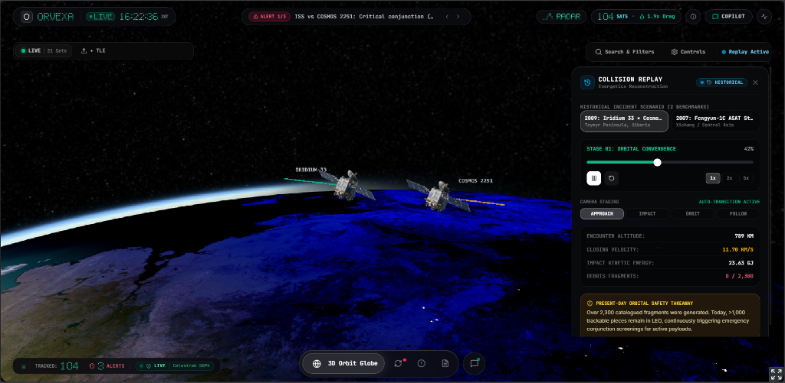
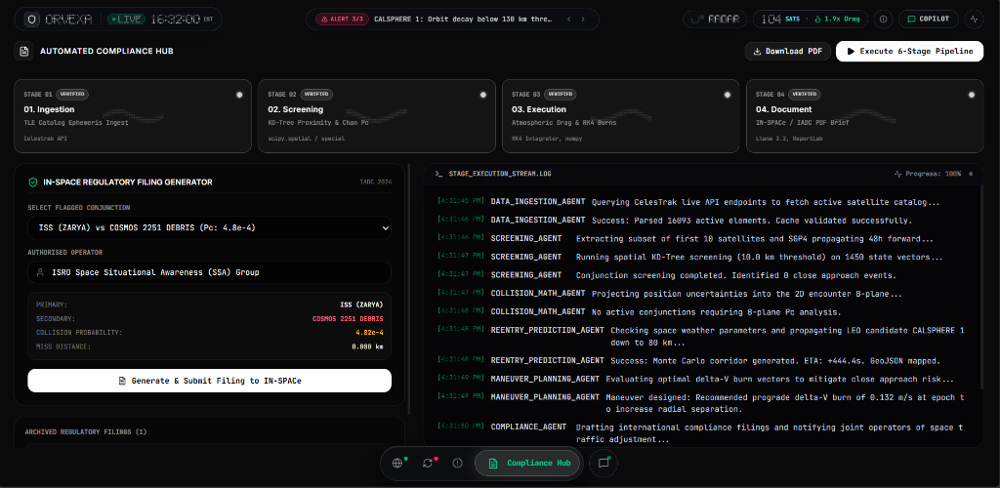

<div align="center">

# 🛰️ ORVEXA

### *Orbital Vigilance & Space Situational Awareness Platform*

[](https://fastapi.tiangolo.com)
[](https://react.dev)
[](https://www.typescriptlang.org)
[](https://python.org)
[](https://tailwindcss.com)
[](https://cesium.com)

> **Real-time 3D satellite tracking, collision avoidance, debris reentry prediction, and AI-powered space compliance — all in one platform.**

[Issues](https://github.com/yug0973/ORVEXA/issues)

</div>

---

## Screenshots

### 🌍 3D Globe — Live Satellite Tracking

> *Interactive Cesium 3D globe with 104 tracked satellites, live conjunction alerts, TLE upload, and replay mode*

---

### ⚠️ Conjunction & Collision Risk Dashboard

> *ISS (ZARYA) vs COSMOS 2251 DEBRIS — 4.82x10-4 Pc, 8h TCA countdown, Delta-V maneuver simulator, B-Plane encounter geometry*

---

### 💥 Collision Replay — Historical Incident Reconstruction

> *3D reconstruction of the 2009 Iridium 33 x Cosmos 2251 collision — 789 km altitude, 11.70 km/s closing velocity, 23.63 GJ kinetic energy, generating 2,300+ debris fragments still tracked today*

---

### 🔥 Reentry & Decay Console

> *CALSPHERE 1 reentry at 185.4 km — decay corridor map, fragment survival rate 18.5%, casualty risk 1.25x10-5 (NASA EVM model)*

---

### ☀️ Solar Weather — Aditya-L1 Real-Time Feed

> *Live Aditya-L1 SoLEXS & HEL1OS X-ray spectrometer telemetry — F10.7 = 136 SFU, Ap = 5.8 nT, thermosphere drag multiplier 1.94x*

---

### 🤖 Flight Copilot — AI Space Operations Assistant

> *Air-gapped LLM assistant for conjunction hazards, B-plane risks, deorbit profiles — raw DB telemetry fallback when offline*

---

### 📋 Automated Compliance Hub — IN-SPACe Regulatory Filing

> *6-stage automated pipeline: TLE Ingestion → KD-Tree Screening → Atmospheric Execution → IN-SPACe Documentation. Live agent log with CelesTrak API, SGP4 propagation, Monte Carlo corridor generation, and one-click filing to IN-SPACe / IADC*

---

## ✨ Features

| Module | Description |
|--------|-------------|
| 🌍 **3D Globe** | Live Cesium globe with 100+ satellites, CZML streaming, replay mode |
| 🛰️ **TLE Propagator** | SGP4 orbital propagation with Skyfield — sub-second accuracy |
| ⚠️ **Conjunction Analysis** | Chan PC + Foster-Elrod collision probability, TCA countdown, miss distance |
| 💥 **Collision Replay** | 3D historical incident reconstruction (Iridium-Cosmos, Fengyun ASAT) |
| 🎯 **Delta-V Simulator** | Interactive maneuver burn optimizer with recalculated Pc + IN-SPACe filing |
| 📊 **B-Plane Plotter** | 2D/3D covariance ellipse encounter geometry visualization |
| 🔥 **Reentry Prediction** | Monte Carlo atmospheric decay with NRLMSISE-00 density model |
| ☀️ **Aditya-L1 Pipeline** | Live SoLEXS & HEL1OS telemetry + NOAA Kp/F10.7 solar indices |
| 🤖 **Flight Copilot** | Llama 3.2 (air-gapped) with raw telemetry DB fallback |
| 📋 **IN-SPACe Compliance** | Auto ITU/FCC regulatory filing generator + one-click submission |
| 📡 **WebSocket Alerts** | Real-time push alerts for conjunction and reentry events |

---

## 🏗️ Architecture

```
ORVEXA/
├── backend/                    # FastAPI Python backend
│   ├── main.py
│   ├── config.py
│   ├── routers/
│   │   ├── satellites.py       # TLE ingestion, CZML streaming
│   │   ├── conjunctions.py     # Collision probability endpoints
│   │   ├── reentry.py          # Decay prediction endpoints
│   │   ├── solar.py            # Space weather + Aditya-L1
│   │   ├── copilot.py          # AI copilot (Ollama/LLM)
│   │   └── compliance.py       # Regulatory filing generation
│   └── services/
│       ├── compliance_generator.py
│       └── swarm_orchestrator.py
│
├── orbital_mechanics/
│   ├── propagator.py           # SGP4 / Skyfield
│   ├── chan_pc.py              # Chan collision probability
│   ├── foster_elrod.py        # Foster-Elrod Pc method
│   ├── decay_engine.py         # Atmospheric drag model
│   ├── monte_carlo_reentry.py  # Monte Carlo reentry
│   ├── solar_weather.py        # NOAA/Aditya-L1 pipeline
│   └── breakup_model.py        # Debris fragmentation
│
├── orvexa-frontend/            # Vite + React 19 + TypeScript
│   └── src/
│       ├── components/
│       │   ├── OrbitGlobe.tsx
│       │   ├── BPlanePlotter.tsx
│       │   ├── CollisionSimulationPanel.tsx
│       │   ├── ReentryMap.tsx
│       │   ├── CopilotDrawer.tsx
│       │   └── Topbar.tsx
│       └── pages/
│           ├── ConjunctionPage.tsx
│           ├── ReentryPage.tsx
│           ├── SolarPage.tsx
│           ├── CopilotPage.tsx
│           └── CompliancePage.tsx
│
├── tests/                      # Pytest suite (11 modules)
├── docs/screenshots/           # README screenshots
└── docker-compose.yml
```

---

## 🚀 Quick Start

### 1. Clone

```bash
git clone https://github.com/yug0973/ORVEXA.git
cd ORVEXA
```

### 2. Backend

```bash
pip install -r requirements.txt
cp .env.template .env
python backend/seed_db.py
python -m uvicorn backend.main:app --host 0.0.0.0 --port 8000 --reload
```

> API: **http://localhost:8000** | Docs: **http://localhost:8000/docs**

### 3. Frontend

```bash
cd orvexa-frontend
npm install
npm run dev
```

> App: **http://localhost:5173**

---

## 🔧 Environment Variables

```env
DATABASE_URL=sqlite+aiosqlite:///./orvexa.db
OLLAMA_BASE_URL=http://localhost:11434
OLLAMA_MODEL=llama3.2
SPACETRACK_USER=your_email@example.com
SPACETRACK_PASS=your_password
FRONTEND_URL=http://localhost:5173
```

---

## 🧠 Key Algorithms

| Algorithm | File | Use Case |
|-----------|------|----------|
| **SGP4** | Skyfield | TLE orbit propagation |
| **Chan P(c)** | `chan_pc.py` | Collision probability |
| **Foster-Elrod** | `foster_elrod.py` | Alternative Pc method |
| **NRLMSISE-00** | `nrlmsise00` | Atmospheric density |
| **Monte Carlo** | `monte_carlo_reentry.py` | Reentry uncertainty |
| **Breakup Model** | `breakup_model.py` | Debris distribution |

---

## 📡 API Reference

| Endpoint | Method | Description |
|----------|--------|-------------|
| `/api/satellites/czml` | GET | CZML stream for 3D globe |
| `/api/conjunctions` | GET | Active conjunction events |
| `/api/conjunctions/{id}` | GET | Detailed Pc + TCA |
| `/api/reentry` | GET | Active reentry predictions |
| `/api/reentry/{id}/map` | GET | GeoJSON decay corridor |
| `/api/solar` | GET | Solar indices |
| `/api/solar/aditya-l1` | GET | Aditya-L1 telemetry |
| `/api/copilot/brief` | POST | AI mission briefing |
| `/api/compliance/filings` | GET | Compliance filings |
| `/api/compliance/file` | POST | Generate filing |
| `/api/ws/alerts` | WS | Real-time threat alerts |

---

## 🛰️ Data Sources

- **TLE Catalog** — CelesTrak (16,000+ active satellites)
- **Solar Weather** — NOAA Space Weather Prediction Center
- **Aditya-L1** — ISRO SoLEXS & HEL1OS real-time telemetry
- **Atmospheric Model** — NRLMSISE-00 density profile

---

## 🧪 Tests

```bash
pytest tests/ -v
```

---

## 🐳 Docker

```bash
docker-compose up --build
```

---

## 👨‍💻 Author

**Yug Brahmbhatt** | [@yug0973](https://github.com/yug0973) | yugbrahmbhatt000@gmail.com

---

## 📄 License

MIT License

---

<div align="center">

**Built with love for the future of space safety**

Star this repo if you find it useful!

</div>