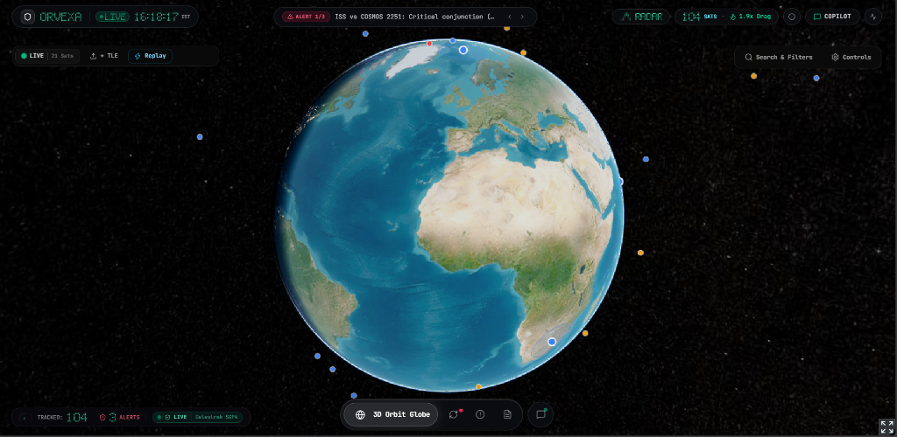
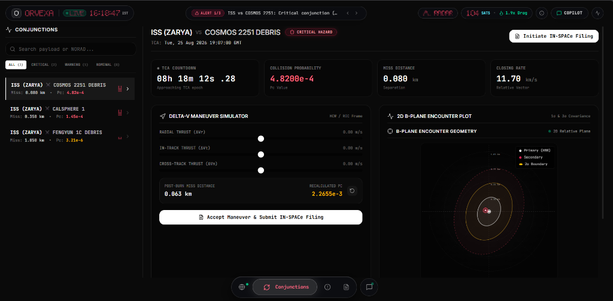
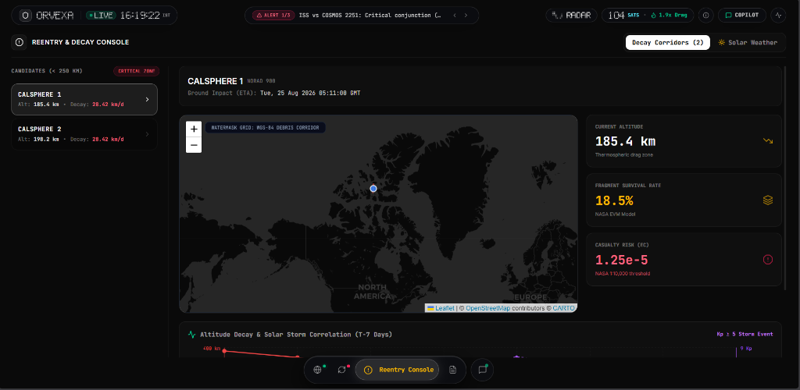
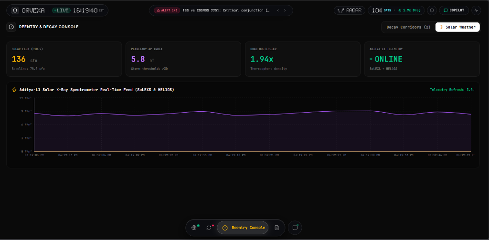
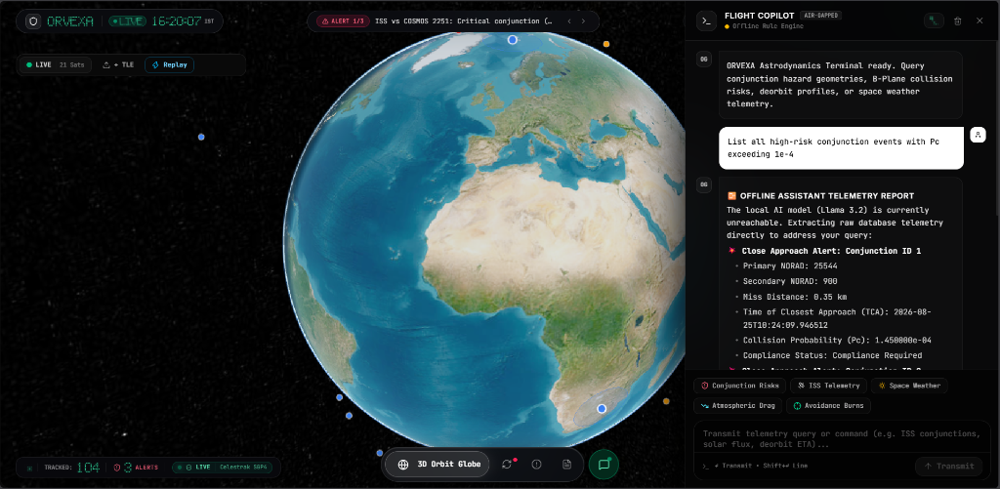

<div align="center">

# 🛰️ ORVEXA

### *Orbital Vigilance & Space Situational Awareness Platform*

[](https://fastapi.tiangolo.com)
[](https://react.dev)
[](https://www.typescriptlang.org)
[](https://python.org)
[](https://tailwindcss.com)
[](https://cesium.com)

> **Real-time 3D satellite tracking, collision avoidance, debris reentry prediction, and AI-powered space compliance — all in one platform.**

[🚀 Live Demo](#) · [📖 Docs](#documentation) · [🐛 Issues](https://github.com/yug0973/ORVEXA/issues)

---

</div>

## 📸 Screenshots

> **Note to maintainer:** Replace the placeholders below with actual screenshots. See [Screenshot Guide](#-screenshot-guide) at the bottom for which screens to capture.

### 🌍 3D Globe — Live Satellite Tracking

> *Interactive Cesium 3D globe showing 16,000+ live satellites with real-time TLE propagation*

---

### ⚠️ Conjunction & Collision Risk Dashboard

> *Probability of collision, miss distance, relative velocity, and risk heatmaps*

---

### 🔥 Reentry & Decay Prediction Map

> *Monte Carlo decay corridors with impact zone overlays on Leaflet map*

---

### ☀️ Solar Weather Monitor (Aditya-L1 Integration)

> *Live NOAA solar flux, Kp index, geomagnetic storm alerts from ISRO's Aditya-L1*

---

### 🤖 AI Copilot — Space Operations Assistant

> *LLM-powered copilot for threat briefings, orbital maneuver advice, and compliance queries*

---

### 📋 Regulatory Compliance Manager

> *Auto-generates ITU/FCC filings, tracks compliance status, manages operator licensing*

---

### 🔐 Entry Portal / Login Screen

> *Dark glassmorphism login screen with animated orbital background*

---

## ✨ Features

| Module | Description |
|--------|-------------|
| 🌍 **3D Globe** | Live Cesium globe rendering 16,000+ satellites via CZML streaming |
| 🛰️ **TLE Propagator** | SGP4 orbital propagation with Skyfield — sub-second accuracy |
| ⚠️ **Conjunction Analysis** | Chan PC + Foster-Elrod collision probability, miss distance computation |
| 🔥 **Reentry Prediction** | Monte Carlo atmospheric decay with NRLMSISE-00 density model |
| ☀️ **Solar Weather** | Live NOAA Kp/F10.7 indices + Aditya-L1 space weather pipeline |
| 🤖 **AI Copilot** | Llama 3.2 (Ollama) powered briefing generator with fallback template |
| 📋 **Compliance** | Auto ITU/FCC regulatory filing generator + compliance dashboard |
| 📡 **WebSocket Alerts** | Real-time push alerts for critical conjunction and reentry events |
| 📊 **Swarm Orchestrator** | Multi-satellite maneuver planning and constellation management |
| 📤 **Data Exporter** | CCSDS, JSON, and CSV export for orbital state vectors |

---

## 🏗️ Architecture

```
ORVEXA/
├── backend/                    # FastAPI Python backend
│   ├── main.py                 # App entrypoint, CORS, routers
│   ├── config.py               # Pydantic settings
│   ├── routers/                # API route handlers
│   │   ├── satellites.py       # TLE ingestion, CZML streaming
│   │   ├── conjunctions.py     # Collision probability endpoints
│   │   ├── reentry.py          # Decay prediction endpoints
│   │   ├── solar.py            # Space weather + Aditya-L1
│   │   ├── copilot.py          # AI copilot (Ollama/LLM)
│   │   └── compliance.py       # Regulatory filing generation
│   └── services/               # Business logic layer
│       ├── compliance_generator.py
│       └── swarm_orchestrator.py
│
├── orbital_mechanics/          # Pure physics computation layer
│   ├── propagator.py           # SGP4 / Skyfield orbit propagation
│   ├── screening.py            # Conjunction screening algorithms
│   ├── chan_pc.py              # Chan probability of collision
│   ├── foster_elrod.py        # Foster-Elrod Pc method
│   ├── decay_engine.py         # Atmospheric drag decay model
│   ├── monte_carlo_reentry.py  # Reentry corridor Monte Carlo
│   ├── solar_weather.py        # NOAA/Aditya-L1 solar pipeline
│   ├── breakup_model.py        # Debris cloud fragmentation
│   └── data_exporter.py        # CCSDS/JSON/CSV export
│
├── orvexa-frontend/            # Vite + React 19 + TypeScript frontend
│   └── src/
│       ├── components/         # Reusable UI components
│       │   ├── Topbar.tsx      # Navigation + alerts
│       │   ├── CopilotDrawer.tsx  # AI assistant side panel
│       │   ├── EntryPortal.tsx    # Auth/login screen
│       │   └── ui/             # Design system components
│       └── pages/
│           ├── GlobePage.tsx       # 3D Cesium satellite globe
│           ├── ConjunctionPage.tsx # Collision risk dashboard
│           ├── ReentryPage.tsx     # Decay prediction + map
│           ├── SolarPage.tsx       # Space weather monitor
│           ├── CopilotPage.tsx     # AI chat interface
│           └── CompliancePage.tsx  # Regulatory compliance
│
├── tests/                      # Pytest test suite
├── docs/                       # Technical documentation
└── docker-compose.yml          # Docker deployment config
```

---

## 🚀 Quick Start

### Prerequisites

- Python 3.11+
- Node.js 20+
- Git

### 1. Clone the Repository

```bash
git clone https://github.com/yug0973/ORVEXA.git
cd ORVEXA
```

### 2. Backend Setup

```bash
# Install Python dependencies
pip install -r requirements.txt

# Copy environment template
cp .env.template .env

# Seed the database
python backend/seed_db.py

# Start the FastAPI backend
python -m uvicorn backend.main:app --host 0.0.0.0 --port 8000 --reload
```

> Backend API available at: **http://localhost:8000**
> Interactive API docs: **http://localhost:8000/docs**

### 3. Frontend Setup

```bash
cd orvexa-frontend

# Install dependencies
npm install

# Start Vite dev server
npm run dev
```

> Frontend available at: **http://localhost:5173**

---

## 🔧 Environment Variables

Copy `.env.template` to `.env` and configure:

```env
# Database
DATABASE_URL=sqlite+aiosqlite:///./orvexa.db

# Ollama AI (optional - falls back to template if unavailable)
OLLAMA_BASE_URL=http://localhost:11434
OLLAMA_MODEL=llama3.2

# Space-Track.org TLE feed (optional)
SPACETRACK_USER=your_email@example.com
SPACETRACK_PASS=your_password

# CORS
FRONTEND_URL=http://localhost:5173
```

---

## 🧪 Running Tests

```bash
# Run full test suite
pytest tests/ -v

# Run specific module tests
pytest tests/test_conjunction_math.py -v
pytest tests/test_decay_reentry.py -v
pytest tests/test_backend_routers.py -v
```

---

## 🐳 Docker Deployment

```bash
# Start all services with Docker Compose
docker-compose up --build

# Production mode
docker-compose up -d
```

---

## 🧠 Key Algorithms

| Algorithm | Implementation | Use Case |
|-----------|---------------|----------|
| **SGP4** | Skyfield library | TLE orbit propagation |
| **Chan P(c)** | `chan_pc.py` | Collision probability |
| **Foster-Elrod** | `foster_elrod.py` | Alternative Pc method |
| **NRLMSISE-00** | `nrlmsise00` package | Atmospheric density |
| **Monte Carlo** | `monte_carlo_reentry.py` | Reentry corridor uncertainty |
| **Breakup Model** | `breakup_model.py` | Debris cloud distribution |

---

## 🛰️ Data Sources

- **TLE Catalog** — CelesTrak (16,000+ active satellites)
- **Solar Weather** — NOAA Space Weather Prediction Center
- **Aditya-L1** — ISRO real-time space weather telemetry
- **Atmospheric Model** — NRLMSISE-00 density profile

---

## 📡 API Reference

| Endpoint | Method | Description |
|----------|--------|-------------|
| `/api/satellites/czml` | GET | CZML stream for 3D globe |
| `/api/conjunctions` | GET | Active conjunction events |
| `/api/conjunctions/{id}` | GET | Detailed Pc analysis |
| `/api/reentry` | GET | Active reentry predictions |
| `/api/reentry/{id}/map` | GET | GeoJSON reentry corridor |
| `/api/solar` | GET | Current solar indices |
| `/api/solar/aditya-l1` | GET | Aditya-L1 telemetry |
| `/api/copilot/brief` | POST | AI mission briefing |
| `/api/compliance/filings` | GET | All compliance filings |
| `/api/compliance/file` | POST | Generate new filing |
| `/api/compliance/download/{id}` | GET | Download filing PDF |
| `/api/ws/alerts` | WS | Real-time threat alerts |
| `/api/ws/swarm/run` | WS | Swarm maneuver planner |

---

## 🗺️ Roadmap

- [ ] Space-Track.org live TLE feed integration
- [ ] Multi-user auth with JWT + operator roles
- [ ] Maneuver planning with delta-V optimizer
- [ ] ITU filing auto-submission API
- [ ] Mobile-responsive dashboard
- [ ] PostgreSQL production database

---

## 📸 Screenshot Guide

> **For the maintainer:** Please capture the following screenshots and place them in `docs/screenshots/`:

| Filename | What to capture |
|----------|----------------|
| `01_globe_dashboard.png` | The main 3D Cesium globe with satellites rendered, from a good orbital angle |
| `02_conjunction_dashboard.png` | The conjunction/collision risk page showing the risk table and heatmap |
| `03_reentry_map.png` | The reentry page with the Leaflet map showing decay corridors |
| `04_solar_weather.png` | The solar weather page with Kp index charts and Aditya-L1 data |
| `05_ai_copilot.png` | The AI copilot drawer open with a sample threat briefing response |
| `06_compliance.png` | The compliance filings page with the table and PDF download |
| `07_entry_portal.png` | The entry/login portal with the animated background |

Place all screenshots in: `docs/screenshots/` and push to trigger the README image previews.

---

## 👨‍💻 Author

**Yug Brahmbhatt**
- GitHub: [@yug0973](https://github.com/yug0973)
- Email: yugbrahmbhatt000@gmail.com

---

## 📄 License

This project is licensed under the MIT License — see the [LICENSE](LICENSE) file for details.

---

<div align="center">

**Built with ❤️ for the future of space safety**

⭐ Star this repo if you find it useful!

</div>