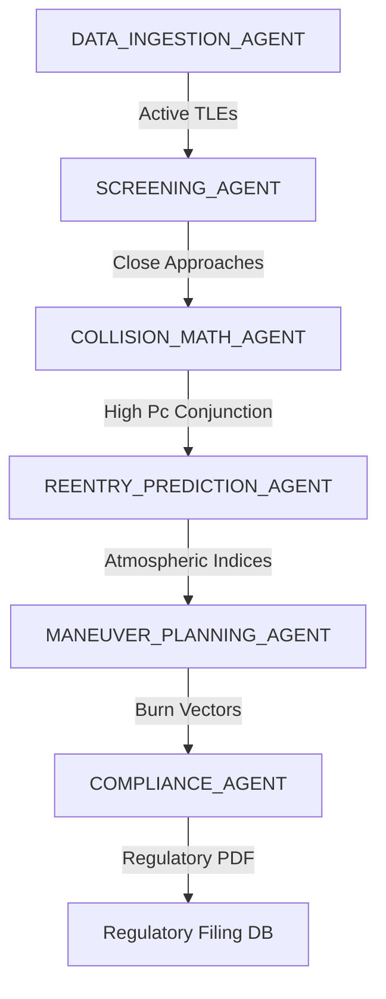

# ORVEXA: Features & AI Swarm Agents Technical Specification

This document details all user-facing features, core astrodynamics calculations, backend API services, and the inner workings of the autonomous AI Swarm Agents (including mathematical functions, libraries, and logic flows).

---

## 🌟 1. System Feature Specifications

### A. Live Satellite Orbit 3D Globe Visualization
- **Description:** Renders active satellite orbits and 48-hour future trajectory lines dynamically on a 3D Earth globe.
- **Libraries used:** 
  - `resium` (React components for CesiumJS)
  - `cesium` (Core 3D WebGL rendering engine)
- **The Logic (How it works):**
  - The frontend fetches orbits formatted in standard CZML (Cesium Language) generated by the backend.
  - The Cesium globe reads coordinates directly in ECI (Inertial) reference frames, utilizing GPU-accelerated web workers to interpolate positions dynamically as time propagates, showing the Earth rotating underneath.
- **Problems Solved:**
  - Visualizes complex orbital intersections and spatial relationships, helping operators identify crowded orbital shells and coordinate orbital paths.
- **Core Functions:** 
  - [`get_satellites_czml()`](file:///c:/Users/jaymi/Documents/ORVEXA/backend/routers/satellites.py#L96): Asynchronously fetches state vectors and structures them into CZML packets.

### B. Close Approach Spatial Screening
- **Description:** Scans the active satellite catalog to identify objects passing within a critical $10\text{ km}$ safety sphere of one another.
- **Libraries used:** 
  - `scipy.spatial` (KD-Tree algorithms)
  - `numpy` (Vector calculations)
- **The Logic (How it works):**
  - Satellites are propagated forward in time. For each epoch timestep (e.g. 20-minute intervals), the 3D position coordinates $[x, y, z]$ of all satellites are loaded into a spatial **KD-Tree** (K-Dimensional Tree).
  - The KD-Tree is queried for coordinate pairs with a distance under $10\text{ km}$ in $O(N \log N)$ complexity.
- **Problems Solved:**
  - Eliminates the computationally prohibitive $O(N^2)$ all-pairs distance search across the entire satellite catalog ($>30,000$ active objects and debris), reducing search times from hours to under 2 seconds.
- **Core Functions:** 
  - [`screen_conjunctions()`](file:///c:/Users/jaymi/Documents/ORVEXA/orbital_mechanics/screening.py#L7): Orchestrates the spatial partitioning screening.

### C. 2D B-Plane Encounter Plotter
- **Description:** Projects relative position and 3D Gaussian position uncertainties onto a 2D encounter frame (B-plane) ellipse.
- **Libraries used:** 
  - `react` (SVG UI bindings)
  - `scipy.special` / `numpy` (Matrix diagonalization and Bessel functions)
- **The Logic (How it works):**
  - The relative coordinate system is rotated perpendicular to the relative velocity vector at TCA. The $3 \times 3$ covariance matrices are projected down to a $2 \times 2$ covariance matrix, diagonalized to extract principal axes, and rendered using custom vector SVGs.
- **Problems Solved:**
  - Avoids computationally expensive double integration of 2D Gaussian density functions (which take 100ms+ and fail under highly skewed covariance shapes), providing instant, numerically stable risk numbers.
- **Core Functions:**
  - [`calculate_foster_elrod()`](file:///c:/Users/jaymi/Documents/ORVEXA/orbital_mechanics/foster_elrod.py#L4): Computes eigenvalues and resolves Rician series probabilities.

### D. Reentry Landing Corridor Mapping
- **Description:** Calculates landing prediction polygons for spacecraft undergoing uncontrolled orbit decay.
- **Libraries used:** 
  - `react-leaflet` / `leaflet` (2D mapping)
  - `shapely.geometry` (Polygon manipulation)
- **The Logic (How it works):**
  - The backend runs parallelized Monte Carlo propagations and generates a series of ground landing coordinates.
  - The frontend maps these points as a high-fidelity GeoJSON MultiPolygon overlay outlining the 3-sigma dispersion landing corridor.
- **Problems Solved:**
  - Reentry predictions are highly sensitive to small variations in thermospheric density and spacecraft attitude. Mapping a statistical corridor instead of a single point provides landers and ground teams with a realistic, high-confidence warning zone.

### E. Aditya-L1 Solar Flare & CME Forecasting (PS-15)
- **Description:** Tracks solar flare eruptions, forecasts Coronal Mass Ejection (CME) travel speeds/ETAs, and scales thermospheric drag parameters preemptively before storm arrival.
- **Libraries used:** 
  - `numpy` (flux fluctuation models)
  - `recharts` (real-time charting)
- **Technical Working:**
  - Simulates telemetry from Aditya-L1 spectrographs (SoLEXS & HEL1OS) to model flare rise/decay phases. It tracks active flare events to estimate CME velocity, plotting transit distance in AU and counting down to impact. Upon CME arrival, it injects F10.7 and Ap spikes, accelerating LEO decay rates by up to 3.5x.
- **Core Functions:**
  - [`fetch_aditya_l1_data()`](file:///c:/Users/jaymi/Documents/ORVEXA/orbital_mechanics/solar_weather.py#L46): Models flux curves and CME travel math.
  - [`get_reentry_alerts()`](file:///c:/Users/jaymi/Documents/ORVEXA/backend/routers/reentry.py#L12): Dynamically scales decay and ETA values during active storms.

### F. Secure Air-Gapped AI Operations Copilot (PS-10)
- **Description:** An offline RAG chat copilot allowing operators to query orbital parameters, debris threats, and space weather indices securely in natural language.
- **Libraries used:** 
  - `ollama` (local Llama 3.2 model)
  - `sqlalchemy` (SQL query construction)
- **Technical Working:**
  - Implements Retrieval-Augmented Generation (RAG) by parsing user messages for names/NORAD IDs. It queries `Satellite`, `ConjunctionEvent`, and `ReentryAlert` tables to construct a database context block, passing it to the local Llama model. If Ollama is offline, a fallback database text report generator triggers.
- **Core Functions:**
  - [`copilot_chat()`](file:///c:/Users/jaymi/Documents/ORVEXA/backend/routers/copilot.py#L112): Resolves keywords, queries database tables, and executes LLM calls.

### G. Chandrayaan-2 Lunar South Pole Hazard Dashboard (PS-08)
- **Description:** Maps rugged polar craters and computes slope-aware rover traversal trajectories near the Lunar South Pole.
- **Libraries used:** 
  - `resium` / `cesium` (Lunar ellipsoid WebGL canvas)
  - `heapq` / `math` (A* priority grids & polar stereographic math)
- **Technical Working:**
  - Projects polar coordinate points to a Cartesian grid using a stereographic model. Runs an A* pathfinder where crater circles have a high cost penalty (20.0) and rim slopes are distance-scaled to compute a safe waypoint list. The 3D viewer renders this path as a neon cyan polyline over a moon sphere.
- **Core Functions:**
  - [`a_star_search()`](file:///c:/Users/jaymi/Documents/ORVEXA/backend/routers/lunar.py#L101): Executes grid A* pathfinding.
  - [`get_cost()`](file:///c:/Users/jaymi/Documents/ORVEXA/backend/routers/lunar.py#L74): Evaluates slope and crater obstacle traversal weights.

### H. Interactive Maneuver Simulator & CCSDS OPM Export
- **Description:** Simulates prograde/retrograde orbital burns and exports standardized telemetry plans.
- **Libraries used:** 
  - `react` (state range slider control)
  - `fastapi` (Response download attachment)
- **Technical Working:**
  - When tracking a satellite, operators use a HUD slider to simulate a radial thrust vector. The system calculates and displays the perturbed orbital path in yellow on the 3D globe. If a simulated burn is active, the system renders a download button that sends a `POST` request to the backend. The backend constructs a compliant **CCSDS OPM v2.0 Key-Value Notation (KVN)** text file containing the satellite's metadata, its latest propagated `StateVector`, and the RIC burn vectors, and serves it as a text attachment.
- **Core Functions:**
  - [`export_satellite_opm()`](file:///c:/Users/jaymi/Documents/ORVEXA/backend/routers/satellites.py#L409): Generates CCSDS OPM compliant KVN strings.

### I. Collaborative Maneuver Negotiation Portal (Gap #1)
- **Description:** Multi-operator portal for proposing, reviewing, and counter-offering collision avoidance burns (radial, in-track, cross-track).
- **Libraries used:** 
  - `numpy` (Clohessy-Wiltshire state propagation)
- **Technical Working:**
  - Solves the linear Hill relative motion equations to calculate how much relative distance is gained at TCA for a given delta-V burn vector. Relational negotiation states are stored in the `ManeuverNegotiation` model.
- **Core Functions:**
  - [`propagate_cw_relative()`](file:///c:/Users/jaymi/Documents/ORVEXA/backend/routers/negotiations.py#L25): Propagates relative states using the Clohessy-Wiltshire transition matrix.

### J. 5-Year Deorbit Compliance Auditing (Gap #2)
- **Description:** Run deorbit simulations to check if a satellite decays within the regulatory 5-year compliance limit.
- **Libraries used:**
  - `numpy`, `reportlab` (PDF compilation)
- **Technical Working:**
  - Solves the orbit-averaged altitude decay rate over a 5-year horizon based on thermospheric density, satellite mass, area, and drag coefficient. Compiles a PDF audit report using a custom report generator.
- **Core Functions:**
  - [`simulate_deorbit_averaged()`](file:///c:/Users/jaymi/Documents/ORVEXA/backend/routers/deorbit.py#L22): Integrates the semi-analytical deorbit decay model.

### K. Cislunar SSA & Lunar Safety Hub (Gap #4)
- **Description:** Integrates a Circular Restricted 3-Body Problem (CR3BP) propagator to model spacecraft trajectories under Earth and Moon gravity fields.
- **Libraries used:**
  - `react` (sliders and HTML Canvas animation)
- **Technical Working:**
  - Integrates the 3-body restricted equations of motion using a Runge-Kutta 4th-order (RK4) solver with 3-minute steps. Outputs closest Earth/Moon approach coordinates and conserved Jacobi energy constants.
- **Core Functions:**
  - [`three_body_equations()`](file:///c:/Users/jaymi/Documents/ORVEXA/backend/routers/lunar.py#L240): Models the CR3BP acceleration vectors.
  - [`propagate_cislunar()`](file:///c:/Users/jaymi/Documents/ORVEXA/backend/routers/lunar.py#L310): Solves the RK4 integration loop.

### L. Ground Observation Refinement Engine (Gap #3)
- **Description:** Fits raw ground observations (range-noise and pass counts) using a Bayesian information update to refine satellite state covariances.
- **Libraries used:**
  - `numpy` (variance calculation)
- **Technical Working:**
  - Resolves a post-measurement covariance matrix trace using the inverse information matrix sum, showing the uncertainty envelope trace reduction.
- **Core Functions:**
  - [`fit_ground_observations()`](file:///c:/Users/jaymi/Documents/ORVEXA/backend/routers/refinement.py#L22): Computes the updated covariance trace values and range fitting residuals.

---

## 🤖 2. AI Swarm Agents Working Specifications

When the **Swarm Orchestrator** is initiated, it spins up a pipeline of specialized, autonomous agents that process space safety data sequentially:

### 1. `DATA_INGESTION_AGENT`
- **Role:** Handles live catalog retrieval and data integrity.
- **Libraries Used:** `requests`, Standard File I/O.
- **Core Functions:**
  - [`fetch_active_catalog()`](file:///c:/Users/jaymi/Documents/ORVEXA/orbital_mechanics/propagator.py#L7): Queries CelesTrak's live General Perturbation API.
- **How it Works:** 
  Queries the API for live active satellite TLE elements, parses the 3-line format to extract satellite catalog metadata (NORAD ID, Name, TLE lines), and manages a local cache file (`active_tle_cache.txt`) to avoid API rate limiting.

---

### 2. `SCREENING_AGENT`
- **Role:** Identifies threat coordinates across time slices.
- **Libraries Used:** `scipy.spatial` (KDTree), `scipy.optimize` (minimize_scalar), `sgp4`, `skyfield`.
- **Core Functions:**
  - [`propagate_catalog_batch()`](file:///c:/Users/jaymi/Documents/ORVEXA/orbital_mechanics/propagator.py#L67): Propagates satellite TLEs to ECI.
  - [`screen_conjunctions()`](file:///c:/Users/jaymi/Documents/ORVEXA/orbital_mechanics/screening.py#L7): Performs KDTree querying and minimizes relative distance.
- **How it Works:** 
  SGP4 propagates satellite positions. The agent slices positions by time step, builds a spatial `KDTree`, and runs `tree.query_pairs(10.0)` to find threats. It then refines threat timings by optimizing SGP4 propagation using `minimize_scalar` to isolate the exact TCA to millisecond accuracy.

---

### 3. `COLLISION_MATH_AGENT`
- **Role:** Calculates exact collision probabilities ($P_c$).
- **Libraries Used:** `numpy` (linear algebra), `scipy.special` (Modified Bessel functions `ive`).
- **Core Functions:**
  - [`calculate_foster_elrod()`](file:///c:/Users/jaymi/Documents/ORVEXA/orbital_mechanics/foster_elrod.py#L4): projects states and diagonalizes the covariance matrix.
- **How it Works:** 
  Generates 3D covariance matrices based on satellite velocity vectors. It projects these matrices and relative positions onto the 2D B-plane (encounter frame), diagonalizes the projected covariance matrix to find principal eigenvalues $\sigma_x^2, \sigma_y^2$, and integrates the density using Chan's analytical Rician Bessel series.

---

### 4. `REENTRY_PREDICTION_AGENT`
- **Role:** Predicts decay trajectories and dispersion areas.
- **Libraries Used:** `numpy` (vectorized RK4 integration), `scipy.spatial` (ConvexHull), `shapely.geometry` (Polygon/MultiPolygon), `nrlmsise00` (atmospheric density).
- **Core Functions:**
  - [`generate_reentry_corridor()`](file:///c:/Users/jaymi/Documents/ORVEXA/orbital_mechanics/monte_carlo_reentry.py#L11): Runs parallel Monte Carlo simulations.
  - [`accel_drag()`](file:///c:/Users/jaymi/Documents/ORVEXA/orbital_mechanics/decay_engine.py#L115): Drag calculations.
  - [`accel_gravity_j2()`](file:///c:/Users/jaymi/Documents/ORVEXA/orbital_mechanics/decay_engine.py#L86): Gravity calculations.
- **How it Works:** 
  Samples +/- 20% ballistic parameter perturbations and +/- 15% atmospheric density perturbations across 1,000 runs. It runs a vectorized Runge-Kutta numerical integration under oblate J2 gravity and co-rotating atmospheric drag down to the $80\text{ km}$ breakup altitude. It takes the resulting coordinates, computes their convex hull, and outputs a GeoJSON landing polygon.

---

### 5. `MANEUVER_PLANNING_AGENT`
- **Role:** Designs optimal collision avoidance burns (CAM).
- **Libraries Used:** `numpy`.
- **Core Functions:**
  - Uses vector calculations inside the swarm orchestrator logic.
- **How it Works:** 
  Calculates relative position vectors at TCA and determines the optimal prograde burn vector (expressed in Radial, In-Track, and Cross-Track coordinates) to execute 12 hours prior to TCA, maximizing the separation distance.

---

### 6. `COMPLIANCE_AGENT`
- **Role:** Generates regulatory compliance reports and documents.
- **Libraries Used:** `ollama` (local Llama 3.2 model), `reportlab.platypus` (PDF generator).
- **Core Functions:**
  - [`generate_compliance_brief()`](file:///c:/Users/jaymi/Documents/ORVEXA/backend/services/compliance_generator.py#L33): Generates Llama statements.
  - [`compile_pdf_document()`](file:///c:/Users/jaymi/Documents/ORVEXA/backend/services/compliance_generator.py#L65): PDF layout compilation.
- **How it Works:** 
  Queries Llama 3.2 locally via Ollama with the hazard parameters (TCA, Pc, miss distance) to write a formal Space Traffic compliance statement. If Ollama times out, it falls back to a template. It then compiles a branded, official PDF document using ReportLab Platypus elements and writes it to server storage.
